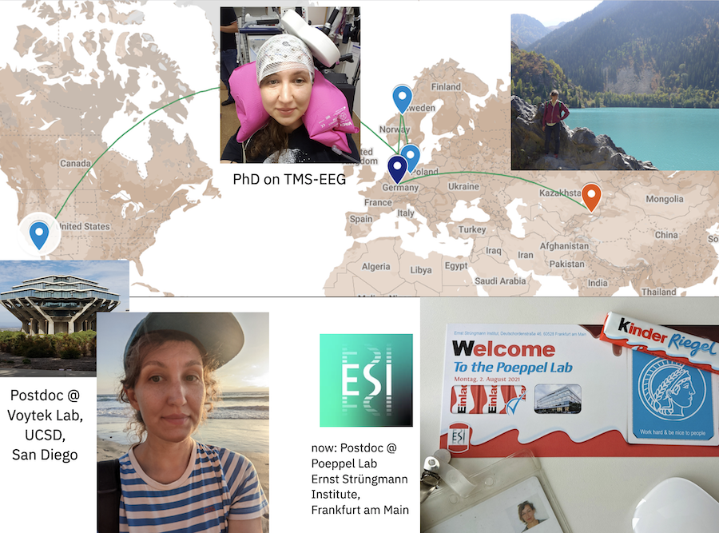

I am a postdoctoral scholar at the Ernst Strüngmann Institute in Frankfurt am Main, Germany, currently funded by a Marie Skłodowska-Curie Postdoctoral Fellowship. I work with [David Poeppel](https://www.esi-frankfurt.de/research/poeppel-lab/) to investigate the spatiotemporal dynamics of EEG, MEG, ECoG, and LFP data. 

Prior to this, I worked at the University of California, San Diego, where I focused on signal processing methods for neuronal oscillations. I hold a Ph.D. in Computer Science from Goethe University Frankfurt, my doctoral research centered on closed-loop brain-state-triggered transcranial magnetic stimulation combined with EEG. Generally, my work aims to improve the methods for analyzing neural oscillations and to investigate the complex mechanisms underlying their generation and their role in brain function. 

