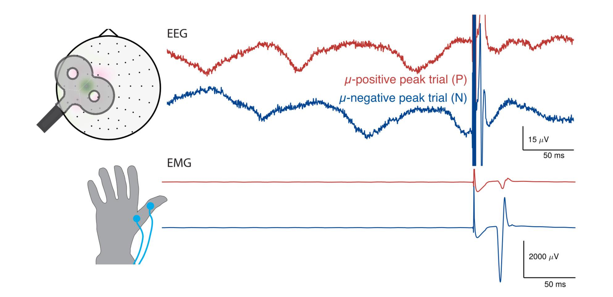

Ongoing brain activity influences behavior, but most non-invasive research in that direction relies on correlational analysis. With transcranial magnetic stimulation, a causal investigation is possible. A large portion of my PhD was concerned with brain-state dependent stimulation: we apply stimulation depending on the phase of the sensorimotor rhythm and observe large modulation of evoked muscle responses depending on the phase. Interestingly, in experiments this is only the case for some subjects, so the factors necessary for the modulation still need to be uncovered. 

<!--more-->

Background: Corticospinal excitability depends on the current brain state. The recent development of real-time EEG-triggered transcranial magnetic stimulation (EEG-TMS) allows studying this relationship in a causal fashion. Specifically, it has been shown that corticospinal excitability is higher during the scalp surface negative EEG peak compared to the positive peak of m-oscillations in sensorimotor cortex, as indexed by larger motor evoked potentials (MEPs) for fixed stimulation intensity. Objective: We further characterize the effect of m-rhythm phase on the MEP input-output (IO) curve by measuring the degree of excitability modulation across a range of stimulation intensities. We furthermore seek to optimize stimulation parameters to enable discrimination of functionally relevant EEGdefined brain states. Methods: A real-time EEG-TMS system was used to trigger MEPs during instantaneous brain-states corresponding to m-rhythm surface positive and negative peaks with five different stimulation intensities covering an individually calibrated MEP IO curve in 15 healthy participants. Results: MEP amplitude is modulated by m-phase across a wide range of stimulation intensities, with larger MEPs at the surface negative peak. The largest relative MEP-modulation was observed for weak intensities, the largest absolute MEP-modulation for intermediate intensities. These results indicate a leftward shift of the MEP IO curve during the m-rhythm negative peak. Conclusion: The choice of stimulation intensity influences the observed degree of corticospinal excitability modulation by m-phase. Lower stimulation intensities enable more efficient differentiation of EEG m-phase-defined brain states.

