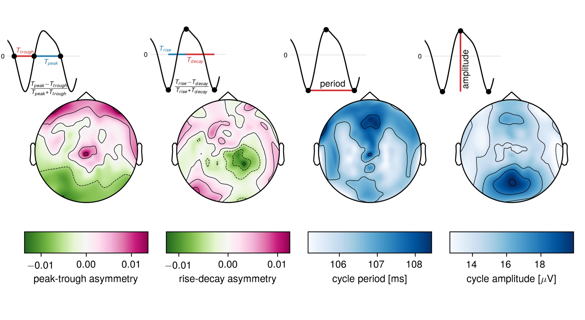

EEG/MEG oscillations have been treated as sinusoids up until recently. But they feature some beautiful waveforms, strongly deviating from a sine wave. In this article with my colleague Vadim Nikulin from the Max-Planck-Institute in Leipzig, we proposed measures of waveform shape in the time domain and explored these measures in a large EEG dataset. 
