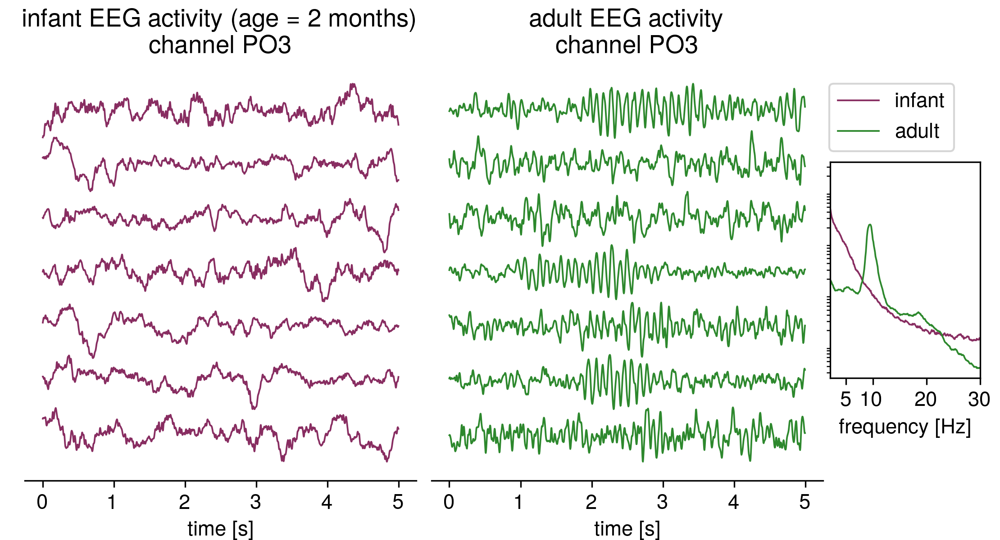

Adults have pronounced alpha-oscillations in the EEG, but young infants lack them. Oscillations emerge only gradually during the first year of life. so, in the EEG power spectrum of a 2-month year old baby, there are no pronounced peaks, they show a 1/f-power spectrum, where the spectral power decreases with increasing frequency. In this article, we looked at changes to this type of aperiodic activity across age and found a very robust decrease in the aperiodic exponent. Quanta Magazine features our work in a popular science article describing this type of brain activity: [“Brain’s ‘Background Noise’ May Hold Clues to Persistent Mysteries”](https://www.quantamagazine.org/brains-background-noise-may-hold-clues-to-persistent-mysteries-20210208).

