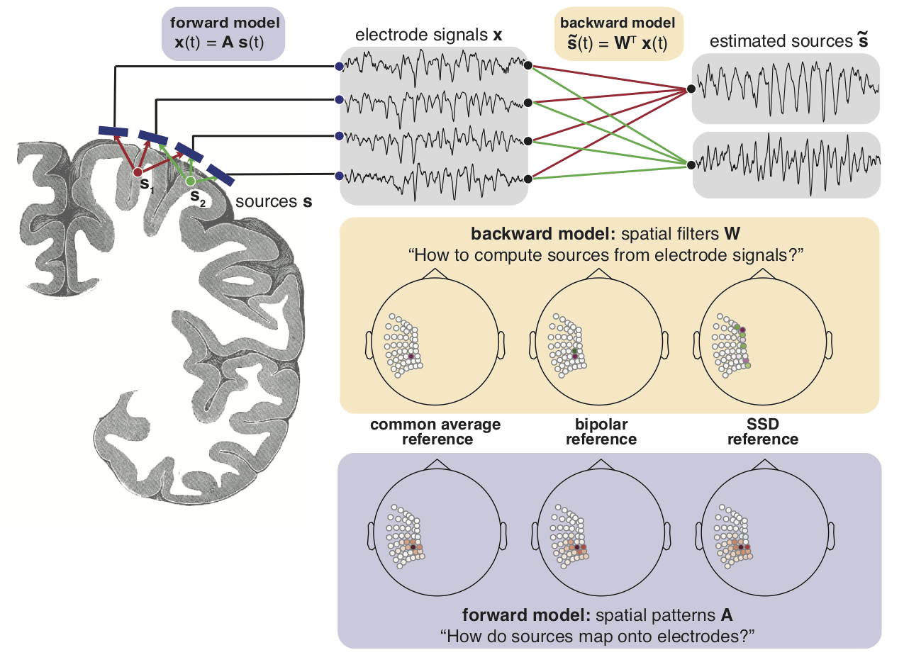

I got to look at a rare type of recordings from the brain, intracranial EEG. Because there are many different types of oscillations & other types of activity present at a given moment in time, they may overlap in space and time. Here we explore if there is a better way of extracting oscillations in this type of data, trying to reconstruct activity generators from the signal recorded on electrodes.