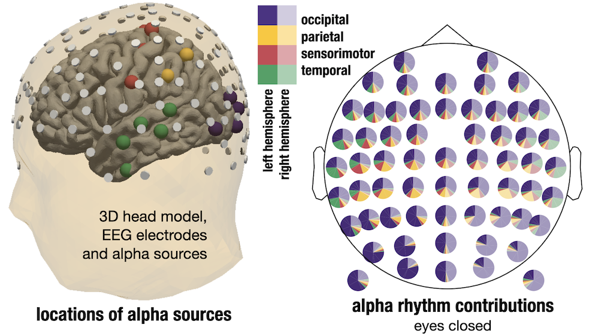

Using simulations and some EEG & MEG data, we visualized how sensor space activity results from the contribution of many different types of alpha-rhythms. Visual alpha rhythms are strong and also contribute a lot of activity of frontal sensors, the extent of it may be surprising.