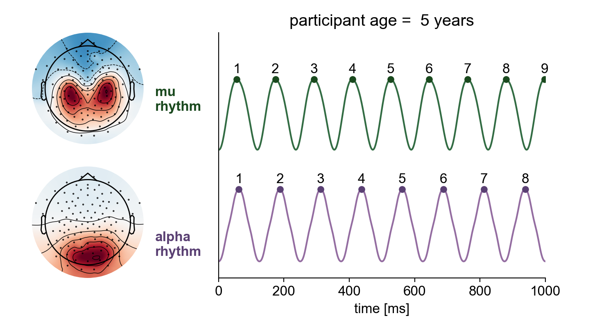

In the field of brain rhythms, one of the rock-solid empirical findings is that oscillatory frequency increases across development, for alpha and mu rhythms. In this new 〰️preprint〰️, we also look at waveform shape across development & neurodevelopmental disorders.

<!--more-->

In the human brain, the alpha rhythm in occipital cortex and the mu rhythm in sensorimotor cortex are among the most prominent rhythms, with both rhythms functionally implicated in gating modality-specific information. Separation of these rhythms is non-trivial due to the spatial mixing of these oscillations in sensor space. Using a computationally efficient processing pipeline, we show that alpha and mu rhythms can be separated from electroencephalography recordings performed on nearly 3000 children aged 5–18. Using the extracted time series for each rhythm, we characterized the waveform shape on a cycle-by-cycle basis and examined whether and how the waveform shape differs across development and in attention-deficit hyperactivity disorder (ADHD) and autism spectrum disorder (ASD). Alpha and mu rhythms both exhibit nonsinusoidal waveform shape that changes significantly across development. We found no differences in the resting-state features of these alpha-band rhythms for either ADHD or ASD in comparison to typically developing participants. While waveform shape is ignored by traditional Fourier spectral analyses, these nonsinusoidal properties may be informative for building more constrained generative models for different types of alpha-band rhythms. Our results highlight the difficulties in identifying targeted biomarkers for ADHD and ASD from resting-state alpha-band rhythms.
