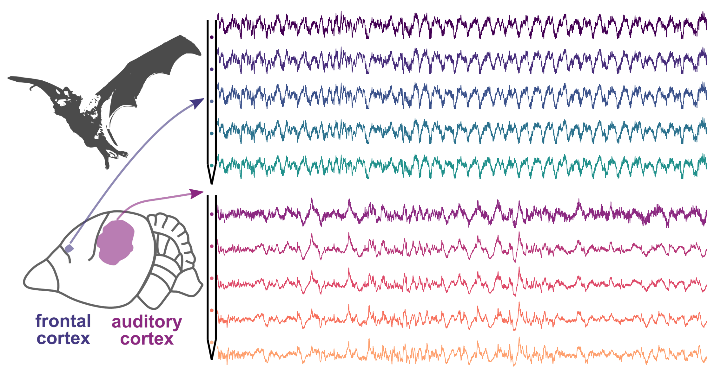

A fun collaboration with my colleague Francisco: This study investigates how the waveform shape of neural oscillations varies between different but functional related cortical areas in the brain, using simultaneous local field potential (LFP) recordings in the auditory and frontal cortices of awake bats. It finds significant differences in waveform shape, even for rhythmic activities of similar frequency, between these regions. Additionally, the study observes consistent variability in waveform shape across individual cycles and a higher correlation between spikes and LFPs in regions with more asymmetric waveforms, particularly in the frontal cortex. These findings suggest that oscillatory activity dynamics are distinct in different cortical areas, reflecting the anatomical and functional diversity of neural circuits.