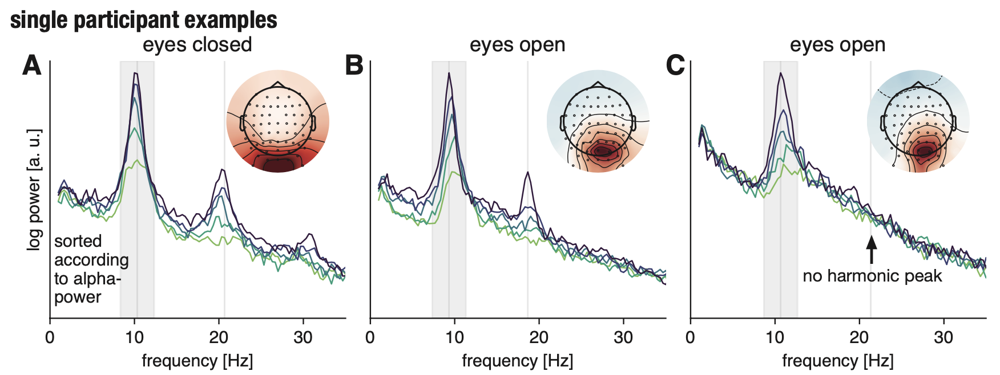

Beta-band activity in the human cortex as recorded with noninvasive electrophysiology is of diverse origin. In addition to genuine beta-rhythms, there are numerous nonsinusoidal alpha-band rhythms present in the human brain, which will result in harmonic beta-band peaks. This type of activity has different temporal and response dynamics than genuine beta-rhythms. Here, it is argued that in the analysis of higher-frequency rhythms, the relationship to lower-frequency rhythms needs to be clarified. Only in that way we can arrive at strong, methodologically valid interpretations of potential functional roles and generative mechanisms of neural oscillations.

