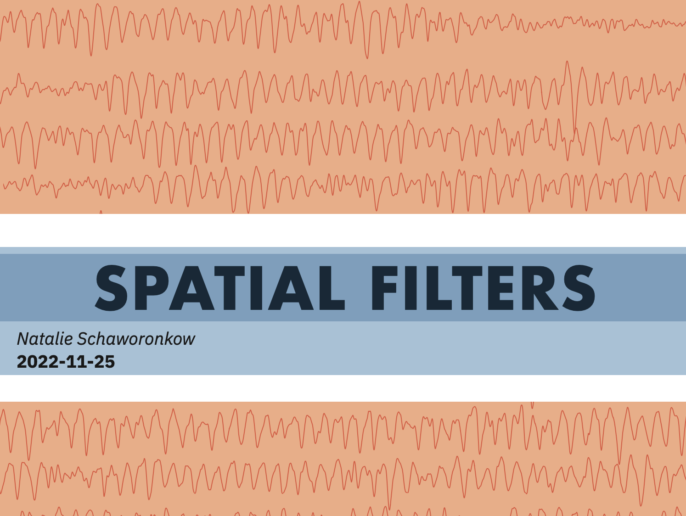

<table style="width: 100%; border-collapse: collapse;">
  <tr>
    <!-- Image cell -->
    <td style="text-align: center; vertical-align: middle; width: 50%;">
      
    </td>
    <!-- Text cell -->
    <td style="text-align: left; vertical-align: middle; width: 50%;">
      Introduction into volume conduction in EEG and spatial filters, some PCA but mostly generalized eigenvalue decomposition. :)
    </td>
  </tr>
</table>