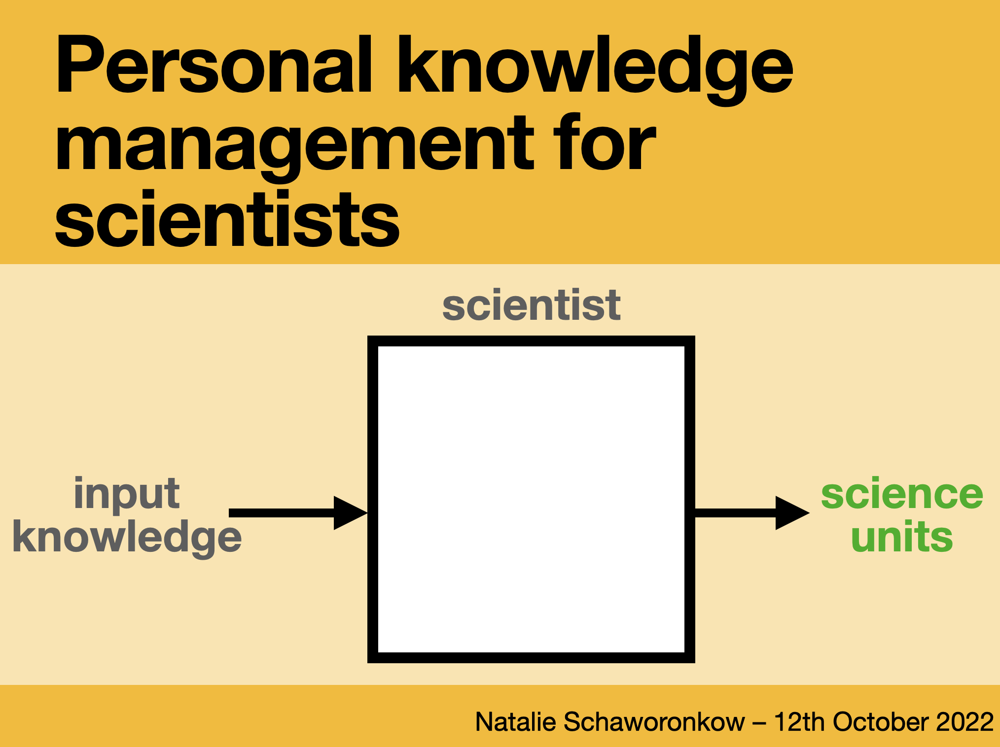
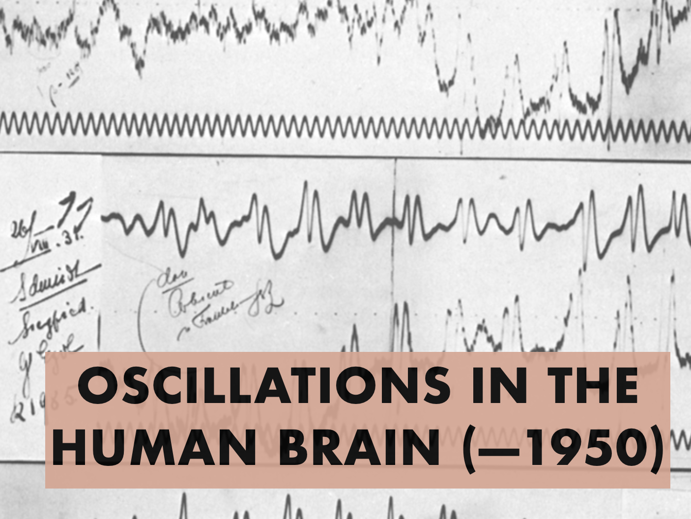

<table style="width: 100%; border-collapse: collapse;">
  <tr>
    <!-- Image cell -->
    <td style="text-align: center; vertical-align: middle; width: 50%;">
      
    </td>
    <!-- Text cell -->
    <td style="text-align: left; vertical-align: middle; width: 50%;">
      How to deal with overwhelming amount of information & how to manage projects.
    </td>
  </tr>
  <tr>
    <!-- Image cell -->
    <td style="text-align: center; vertical-align: middle; width: 50%;">
      
    </td>
    <!-- Text cell -->
    <td style="text-align: left; vertical-align: middle; width: 50%;">
      Telling the early history of EEG, between self-doubt and the joy of discovery.  :)
    </td>
  </tr>  
</table>