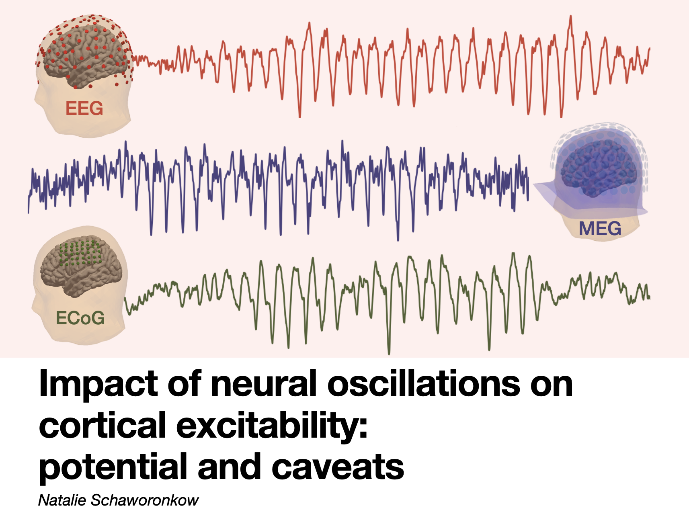

<table style="width: 100%; border-collapse: collapse;">
  <tr>
    <!-- Image cell -->
    <td style="text-align: center; vertical-align: middle; width: 50%;">
      
    </td>
    <!-- Text cell -->
    <td style="text-align: left; vertical-align: middle; width: 50%;">
      Presented my work on TMS-EEG excitability and lots of caveats for intepretation of results in the realm of neural oscillations (spatial mixing, 1/f-activity, waveform shape).
    </td>
  </tr>
</table>

