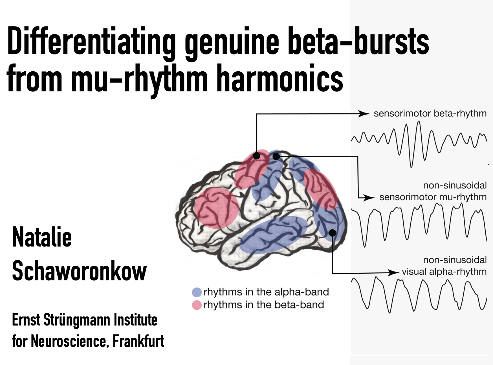

<table style="width: 100%; border-collapse: collapse;">
  <tr>
    <!-- Image cell -->
    <td style="text-align: center; vertical-align: middle; width: 50%;">
      
    </td>
    <!-- Text cell -->
    <td style="text-align: left; vertical-align: middle; width: 50%;">
      Presented in a symposium dedicated to phase of oscillations that I co-organized together with Prof. Christoph Zrenner from the university of Toronto.
    </td>
  </tr>   
  <tr>
    <td style="text-align: center; vertical-align: middle; width: 50%;">
    we had a cool program:
    </td>  
    <td style="text-align: left; vertical-align: middle; width: 50%;">
    <ul>
    <li>Paolo Belardinelli: Localising alpha and beta oscillations in the EEG to their cortical source</li>
    <li>Catharina Zich: Spatiotemporal organisation of human sensorimotor beta burst activity</li>
    <li>Natalie Schaworonkow: Differentiating genuine beta bursts from mu-rhythm harmonics</li>
    <li>Anirudh Wodeyar: State space models for estimating phase</li>
    <li>Christoph Zrenner: Does the phase of sensorimotor beta oscillations predict corticospinal excitability?</li>
    </ul>
    </td>        
  </tr>
</table>
