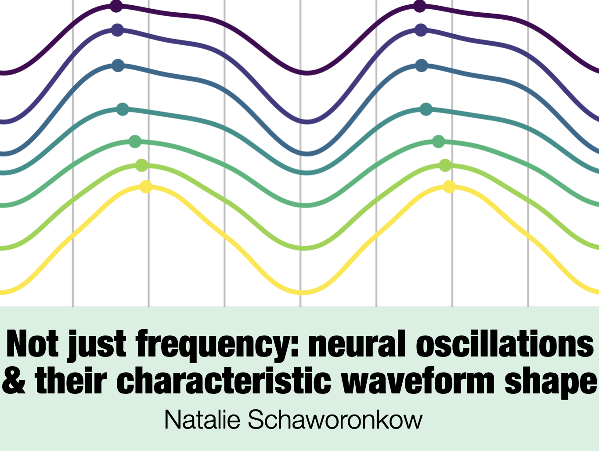
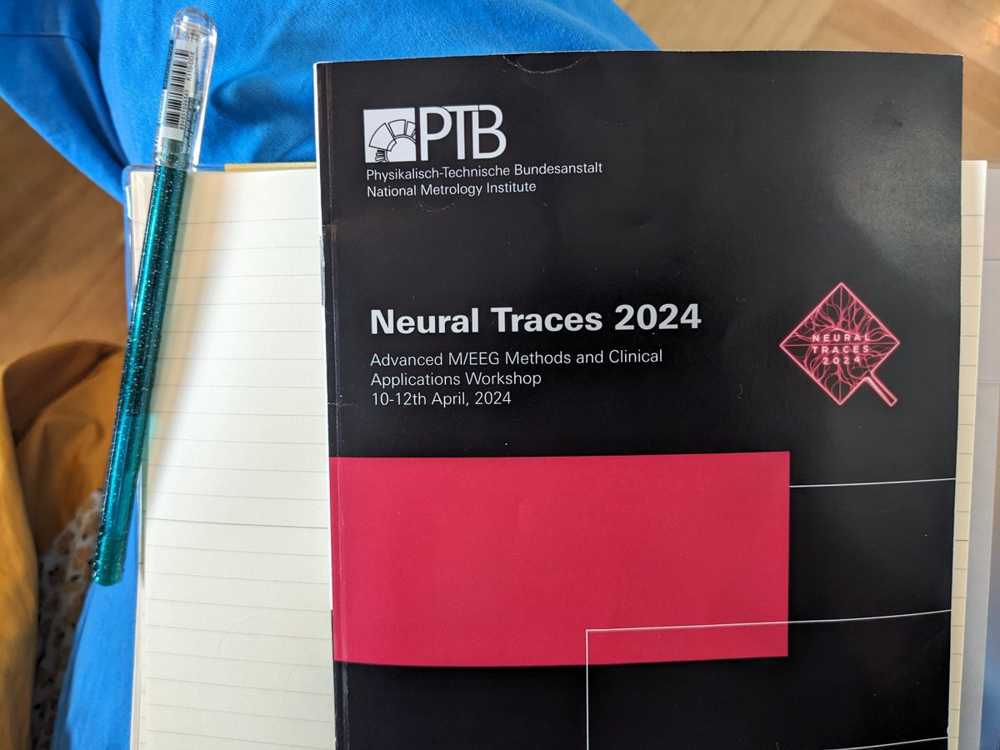

<table style="width: 100%; border-collapse: collapse;">
  <tr>
    <!-- Image cell -->
    <td style="text-align: center; vertical-align: middle; width: 50%;">
      
    </td>
    <!-- Text cell -->
    <td style="text-align: left; vertical-align: middle; width: 50%;">
      Presented some cautionary statements regarding interpretation of neural oscillations & some cool waveshape phenomena . :)
    </td>
    </tr>
    <tr>
    <td style="text-align: center; vertical-align: middle; width: 50%;">
      
    </td>   
    <td style="text-align: left; vertical-align: middle; width: 50%;">
    The conference was organized supernicely and I took home lots of methods inspiration.
    </td> 
  </tr>
</table>
