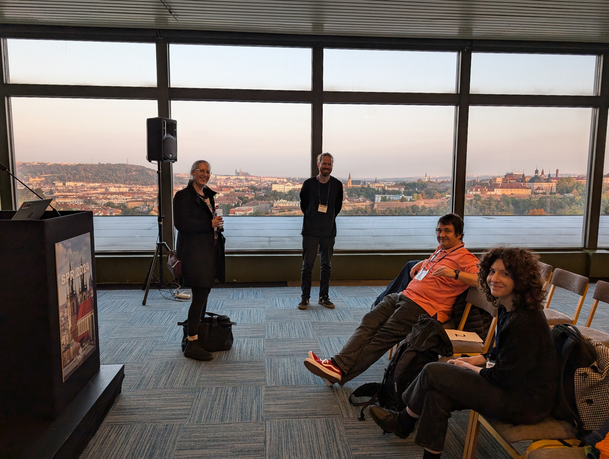

<table style="width: 100%; border-collapse: collapse;">
  <tr>
    <!-- Image cell -->
    <td style="text-align: center; vertical-align: middle; width: 50%;">
      
    </td>
    <!-- Text cell -->
    <td style="text-align: left; vertical-align: middle; width: 50%;">
      Presented historical snippets of time domain and spectral analysis and their link to waveshape phenomena.
    </td>
    </tr>
    <tr>
    <td style="text-align: center; vertical-align: middle; width: 50%;">
      
    </td>   
    <td style="text-align: left; vertical-align: middle; width: 50%;">
    Other symposium speakers were supernice, all the talks in our symposium:

<ul>
<li>Cliodhna Quigley: Forgotten Rhythms – Learning From the Past</li>
<li>Natalie Schaworonkow: Berger's Rhythm and the Harmonic Hurdles</li>
<li>Fabian Schmidt: The Role of Alpha Bursts in Supra-Sensory Perception</li>
<li>Alice Tomassini: The (Visuo)Motor Side of the Berger's Rhythm – Linking Perception to Action</li>
<li>Tzvetan Popov: Waves Beyond Waveforms</li>
</ul>
    </td> 
  </tr>
</table>
