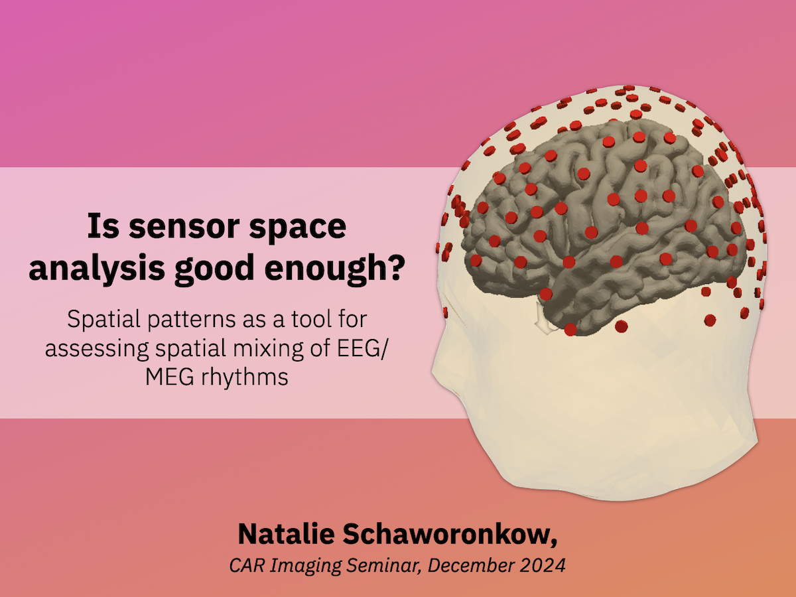

<table style="width: 100%; border-collapse: collapse;">
  <tr>
    <td style="text-align: center; vertical-align: middle; width: 50%;">
      
    </td>
    <td style="text-align: left; vertical-align: middle; width: 50%;">
      Presented a journal club talk on our 2022 paper about spatial mixing: <a href="https://nschawor.github.io/publication/2022_schaworonkow_sensor_space">Is sensor space analysis good enough?</a>
    </td>
    </tr>
</table>
